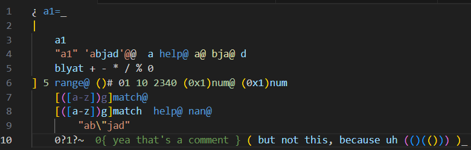

# WhatLang README we guess

This is the README for the extension "whatlang". Right but [WhatLang](https://esolangs.org/wiki/WhatLang) is an esolang that is stack-based.

## Features

oh I need GitHub to make this pic available?

I don't know how to do it here. But that's the screenshot of the first (on VS Code) highlighted WhatLang Program.

## Extension Settings

This extension contributes the following settings:

* no.

## Known Issues

* I hadn't done that thing.
* I forgor to bring the interpreter within.

## Release Notes

### 0.0.0

Initial release of WhatLang.

### 0.0.1

Changed the color of multiple keywords.